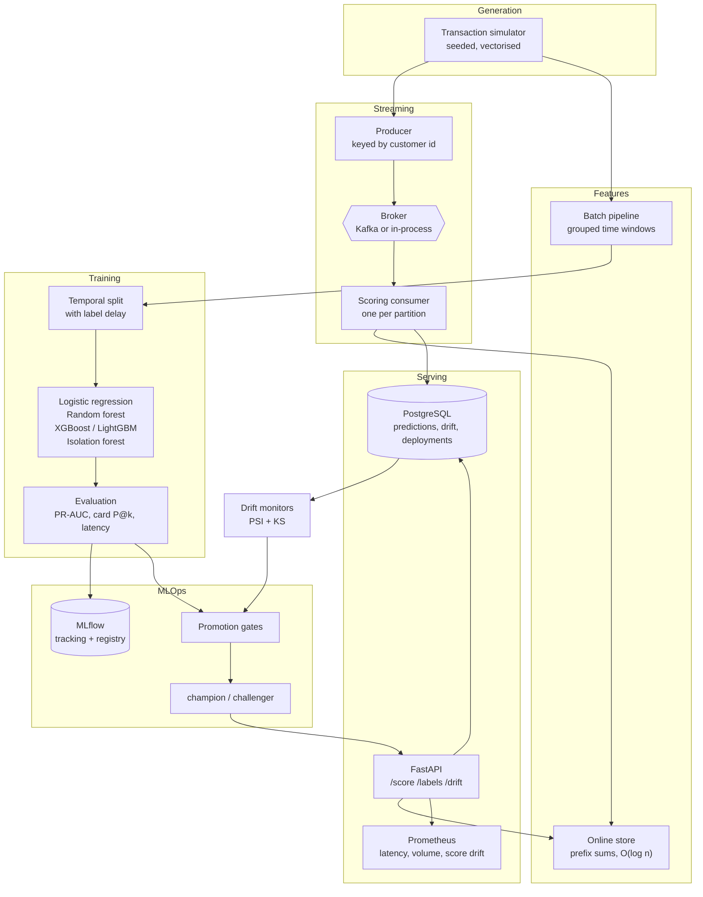

# Architecture

## Pipeline

## Design decisions

Each was a real choice with a real alternative. The reasoning matters more than
the conclusion, because the right answer changes with the data.

### A generator rather than a downloaded dataset

Real card data is not redistributable and the public alternatives destroy the
entity structure the whole feature methodology depends on. A seeded generator
gives reproducibility, arbitrary scale, and known ground truth about which
pattern produced each fraud. The cost — it only contains the patterns it was
told to contain — is stated in `docs/data-sources.md` rather than glossed over.

### A delay period between train and test

This is the decision that most affects whether the reported numbers mean
anything. A fraud label does not exist when the transaction happens; it exists
days later when an investigation closes. Training right up to the test boundary
uses labels that would not have arrived, and every metric inflates.

So the split leaves a seven-day gap, and terminal risk features are computed
over a window ending seven days before the transaction being scored. Customer
count and amount features carry no delay because they need no labels.

`tests/test_features.py` asserts the property directly: a fraud confirmed on day
D must not change any feature computed before D + delay. It is checked at delays
of 0, 3, 7 and 14 days.

### PR-AUC as the headline metric

At a 0.83% base rate, accuracy is meaningless and ROC-AUC is optimistic — it is
dominated by the vast negative class, so hundreds of extra false positives
barely move it. Measured on the same scores at full scale: random forest has the
*best* ROC-AUC (0.9012) and only the third-best PR-AUC (0.7053). Ranking on
ROC-AUC would have picked the wrong model, and the wrong model is also the one
that is 81× slower to serve.

Card precision at *k* is reported alongside, because an investigation team has a
fixed daily capacity, not a fixed score threshold.

### Online features that provably match batch

Training/serving skew is the failure mode this design exists to prevent: a model
trained on batch features and served subtly different online features degrades
in a way that looks like drift and gets misdiagnosed for weeks.

The online store keeps per-entity arrays with a prefix sum, so a window query is
two binary searches and a subtraction. `tests/test_features.py` replays a stream
through both paths and asserts the vectors agree; replayed over the whole test
window at full scale, 556,547 events, they agree to float32 rounding.

The first implementation scanned the window backwards, O(events in window) per
query. Measured against the prefix-sum version, the gap depends entirely on how
much history an entity holds:

| Events held | Backward scan | Prefix sum | |
| ---: | ---: | ---: | ---: |
| 40 | 0.0052 ms | 0.0014 ms | 4× |
| 400 | 0.0414 ms | 0.0018 ms | 24× |
| 4,000 | 0.4682 ms | 0.0023 ms | 200× |
| 40,000 | 5.7015 ms | 0.0038 ms | 1,515× |

At the depth this configuration actually holds — around 40 events per entity
after eviction — the scan is only 4× worse, which is worth knowing: the
prefix-sum design is about not degrading as retention grows, not about the
throughput it has today. The measured throughput collapse had a different cause;
see [`results.md`](results.md#the-streaming-throughput-collapse).

### Partition by customer, and pay for it on the terminal side

Online features are stateful per customer, so every transaction for a customer
must reach the same consumer. Assigning records to partitions round-robin
scatters a customer's history across workers and every window feature is
computed from a fraction of it — silently, with no error.

The partition function is a deliberate hand-rolled hash rather than Python's
built-in `hash`, which randomises string hashing per process: a restart would
reshuffle every customer.

That choice is right for customer features and it has a cost the design has to
answer for: **terminal** state is shared across every partition. Terminal risk
is the strongest feature family here, and the events that build it arrive
interleaved from four partitions with no global ordering. Two mechanisms keep it
correct:

1. **The consumer polls every partition at the same rate.** Filling a batch from
   one partition before touching the next hands the consumer that partition's
   entire history, then restarts it at the beginning of time for the next.
   Measured on the full stream, that left 75% of events being scored behind the
   consumer's own clock by a mean of 28 days, and cost **0.24 PR-AUC** — with no
   error raised and no visibly wrong value anywhere. See
   [`results.md`](results.md#the-partition-drain-bug).
2. **Labels are applied in event time, not arrival order.** Pending labels sit in
   a min-heap and are released against a watermark, so nothing reaches the
   feature store until the stream has certainly moved past it. The seven-day
   label delay doubles as the reordering allowance; measured cross-partition
   skew is 2.9 days, comfortably inside it. A label later than the allowance is
   counted and dropped rather than applied out of order, because the online
   history is a prefix-sum index that is only valid over sorted timestamps.

The general lesson is that partitioning solves state locality for exactly one
entity. Any second entity whose state spans partitions needs event-time
processing, and gets silent corruption without it.

### A broker abstraction with a real in-process implementation

`InProcessBroker` is not a stub. It implements partitioning, consumer groups,
committed offsets and at-least-once delivery — the semantics the consumer
depends on. That means the whole streaming path runs and is measured with no
external service, which is what makes the throughput figures reproducible from a
clean checkout.

Delivery is at-least-once: offsets commit after processing, so a crash replays
the batch. Scoring is idempotent, so a replay costs work rather than
correctness. Exactly-once would need transactional writes to the prediction
store — a heavier guarantee than this system needs.

### Retraining and promotion are separate decisions

Conflating them is how a pipeline auto-deploys a worse model on every drift
blip. Deciding to *retrain* is cheap and fires liberally: on a drift alert, on a
measured performance drop, or on age. Deciding to *deploy* is expensive to get
wrong and is gated hard.

Five gates, each a measured comparison: an absolute PR-AUC floor, an improvement
margin over the incumbent, a minimum number of frauds in the evaluation window,
a bounded latency regression, and a bounded calibration regression. A candidate
must clear all of them, and a refusal names the gate and the numbers.

The calibration gate exists because scores feed a threshold. A model whose
ranking improved but whose probabilities shifted invalidates the operating point
without changing PR-AUC at all.

### Four model families, and an unsupervised contrast

Not padding. Logistic regression is the baseline that says whether the features
carry interactions worth modelling. Random forest and the two boosting libraries
differ in how they handle imbalance, and the gap between XGBoost and LightGBM is
worth measuring rather than assuming. Isolation forest never sees a label, so it
shows how much signal is reachable from outlier structure alone — measured at
PR-AUC 0.285 against 0.731 supervised, which is a useful floor.

Imbalance is handled by reweighting, not resampling. Undersampling discards most
of the data; oversampling a few thousand frauds mostly duplicates rows, which
boosted trees overfit quickly.

## Storage

| Data | Store | Why |
| --- | --- | --- |
| Transactions and predictions | PostgreSQL (SQLite locally) | Relational queries, indexed by customer and time for the online lookups |
| Online feature state | In process | Per-partition, keyed by customer; Redis when replicas must share it |
| Experiments and model registry | MLflow on SQLite | Runs offline with no server; the file store is deprecated and refuses to start |
| Drift observations | PostgreSQL | So a performance regression can be correlated against what the inputs were doing |
| Deployment history | PostgreSQL | So a metric can be attributed to the model version that produced it |

One SQLAlchemy Core schema serves SQLite and PostgreSQL, so the test database
cannot drift from the deployed one. The PostgreSQL-native DDL, including the
indexes Core cannot express portably, is at `src/rtml/data/sql/schema.sql`.

## Observability

| Metric | Type | What it catches |
| --- | --- | --- |
| `rtml_transactions_scored_total` | counter | Throughput |
| `rtml_alerts_total` | counter | Investigation queue volume |
| `rtml_scoring_latency_seconds` | histogram | Service level |
| `rtml_score_distribution` | histogram | Prediction drift — the leading indicator |
| `rtml_feature_state_entities` | gauge | Online state growth |

The ordering matters. Feature and prediction drift move within minutes;
precision regressions surface only once investigations close, days later. The
leading indicators are alerted on precisely because the lagging one cannot be
measured yet. Rules are at `deployment/prometheus/alerts.yml`.

## Scaling

Beyond what was actually measured here (1.8M transactions, single process).
Stated as a design position, not a claim:

- **Feature state is per-partition**, so horizontal scaling means more
  partitions, each owning a disjoint set of customers. The consumer is already
  written for this; what is untested is rebalancing, which needs the store
  rehydrated from a snapshot on partition reassignment.
- **A cold consumer scores measurably worse** until its windows fill — PR-AUC
  0.6245 against 0.7312 warmed, measured on the full test window. Recall falls
  from 0.621 to 0.484: 634 frauds missed over eight weeks. Any restart,
  deployment or rebalance pays this, so the warm-up path belongs in the startup
  probe, before the instance takes traffic.
- **The API holds its own feature state**, so several replicas each hold a
  partial view. Either route a customer consistently to one replica, or move the
  store into Redis. The second is the right answer above a handful of replicas.
- **Random forest is not viable for this path** at 68.5 ms p95 against
  LightGBM's 0.85 ms, regardless of its accuracy.
